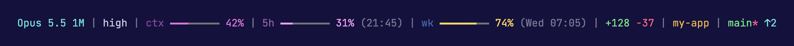

# my-claude-statusline

A compact, colorful status line for [Claude Code](https://claude.com/claude-code).



## What it shows

| Segment | Example | Notes |
| --- | --- | --- |
| Model | `Opus 5.5 1M` | `(1M context)` is shortened to `1M` |
| Effort | `high` | Hidden on models without effort levels |
| Context | `ctx ━━━━ 42%` | Context window usage |
| 5-hour limit | `5h ━━━━ 31% (21:45)` | Usage and local reset time |
| Weekly limit | `wk ━━━━ 74% (Wed 07:05)` | Usage and reset day/time |
| Lines changed | `+128 -37` | Hidden until something changes |
| Directory | `my-app` | Current working directory name |
| Git | `main* ↑2 ↓1` | Branch, `*` if dirty, commits ahead/behind upstream |

Usage bars turn yellow at 70% and red at 90%. The rate-limit segments only
appear on Claude subscription plans, once the first response has come back.

## Requirements

- `bash` and `jq`
- `git` (optional, for the git segment)
- macOS or Linux

## Install

```bash
git clone https://github.com/kyleoliveiro/my-claude-statusline.git ~/Projects/my-claude-statusline
ln -sf ~/Projects/my-claude-statusline/statusline.sh ~/.claude/statusline.sh
```

Then add this to `~/.claude/settings.json`:

```json
{
  "statusLine": {
    "type": "command",
    "command": "bash ~/.claude/statusline.sh"
  }
}
```

The status line picks up changes on its next refresh; no restart needed. With
the symlink in place, a `git pull` updates it.

## Customize

Edit the variables near the top of the rendering section in `statusline.sh`:

- `WARN_PCT` / `CRIT_PCT`: thresholds for yellow and red bars (default `70` / `90`)
- `BAR_WIDTH`: number of cells in each bar (default `8`)
- `COLOR_*`: ANSI colors for each segment

To try a change without waiting for Claude Code, pipe sample JSON in:

```bash
echo '{"model":{"display_name":"Opus 5.5 (1M context)"},"cwd":"'"$PWD"'","context_window":{"used_percentage":42}}' \
  | bash statusline.sh
```
